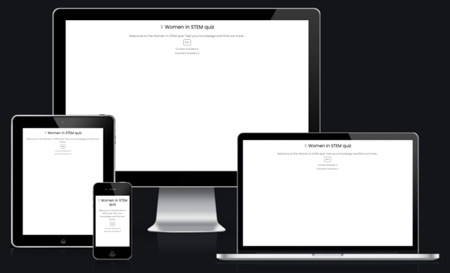

# Women in STEM Quiz

Women in STEM Quiz is a quiz site designed for users to test their level of knowledge about women in the fields of science,  technology, engineering and maths ("STEM"). The site aims to be entertaining but also educational, providing feedback and additional information on each answer as the user progresses through the quiz, and providing links at the end for users to find out more information should they so desire.

The site has been created for the second milestone project for Code Institute's Diploma in Full Stack Software Development.

You can visit the live website [here](https://frankiesanjana.github.io/women-in-STEM-quiz/).

## Concept

Women are still significantly underrepresented in the science, technology, engineering and maths (“STEM”) workforce. [A study](https://www.pnas.org/doi/pdf/10.1073/pnas.1914221117) published by PNAS in 2020 compared gender inequality across 83 countries and found the following:
- In scientific publications, there was an overall author gender ratio of 73% to 27%
- Male authors published a higher total number of papers over their career
- After a paper had been published for 10 years, male authors’ papers were cited 30% more on average than those by women

There are many reasons for this discrepancy, but one is that during their school years, girls and boys are treated differently, with girls often being steered towards studying “softer” subjects such as home economics at school, and boys towards, for example, computer science.

A greater awareness of women in STEM can help to provide positive female role models for both girls and boys from a young age. This can change girls’ and women’s attitudes towards and identification with maths and science, and increase their ability to consider STEM fields as viable career options. Knowledge of female role models has also been demonstrated to reduce the implicit biases that are shown via studies to be present in both men and women.

Much more detail on this topic is available [in this report](https://www.aauw.org/app/uploads/2020/03/Solving-the-Equation-report-nsa.pdf) by the AAUW, a non-profit organisation in the USA that advances equity for women and girls through advocacy, education, and research.

This Women in STEM quiz therefore aims to allow its users to test their knowledge about historical and current women in STEM fields in a manner that is entertaining and challenging, while also adding to users’ knowledge and demonstrating to them the importance of women in key scientific inventions and discoveries throughout history.

The site is designed to cater for a range of users. Parents, teachers and schoolchildren might all be interested in the site because of its educational properties. Adults working in STEM fields might also want to learn more about the role of women in their fields. These user stories are described in more detail below.

### User Stories

User stories are focused around specific needs that visitors to a quiz site on this topic might have, as mentioned above.

- As a parent of younger children, I would like my children to grow up with knowledge of a range of positive female role models in STEM fields,  but I am unsure whether I have this knowledge myself. I would like to test my own knowledge and find out about women in STEM who I may previously have been unaware of.
- As a parent of older children, I would like to find a quiz site for my children to use so that they gain greater awareness of women in STEM fields, both to inform their own choices about what subjects they study and also to help them gain a greater appreciation of women’s abilities in and historical contribution to science.
- As a teacher, I would like to find content and information for my lessons, potentially enhance my knowledge, and help to provide my pupils with information about women in STEM fields, in particular to encourage girls who are uncertain about their own choices or abilities to believe that science is a viable choice for them.
- As a younger child, I would like a quiz to entertain me and find out more about the scientists behind interesting discoveries.
- As an older child or teenager who is interested in science, I would like to test my knowledge with a quiz to know more about what women have done in STEM fields historically.
- As a female student in a science-related discipline, I would like to test and enhance my knowledge about women in science, and be able to provide information to others.
- As an adult female working in a science-related field, I would like to have better knowledge of other women who have been active in STEM over the years to enhance my own confidence and potentially help to inform others’ beliefs or challenge negative assertions about women in science.
- As an adult of either gender, I would like an entertaining and informative quiz to test my own knowledge, learn more about women in science and possibly share the information I learn with others.

### Owner Goals

- As the site owner, I want to fulfil the needs and wishes of these users.
- As the site owner, I want to provide clear and accurate information.
- As the site owner, I want to provide an enjoyable experience for users, where users can play through the quiz easily and intuitively.
- As the site owner, I want users to be able to access the site from any size of device.
- As the site owner, I want users to be inspired to learn more about women in STEM. As such, I want to provide some basic information, but also link out to external sources from which users can find out more.
- As the site owner, I want users to enjoy the site and find it interesting enough that they think it is worth sharing with others.

## Design

The website was designed according to the five planes of content strategy. Using this structure provided a framework to develop the website. This is explained in more detail below.

### Plane 1: Strategy

The strategy of the website is largely defined by the user and owner goals listed above in the Concept section. The strategy is simply to provide solutions to the goals of the website's users and owners.

### Plane 2: Scope

The website includes the following features:

- A welcome page, to welcome users to the site and invite them to start the quiz.
- Ten questions, each with four possible answers. Questions are randomised each time a user loads the site and are displayed one at a time.
- User feedback on their answer: when a user selects an answer, each answer button turns green or red to show which was the correct answer. Extra information about each of the four answers is then loaded, displaying information about the correct answer first.
- A score tracker so that the user can see how many questions they have answered correctly and incorrectly as they progress through the quiz.
- User feedback at the end of the quiz, with a message tailored to their final score
- Links to further information at the end of the quiz so that users can find out more. These are chosen to link to one UK-based organisation, one US-based organisation and one global organisation, aiming to provide relevant detail for as many users as possible while also not overloading them with too many links.
- A restart button, so that users are invited to try the quiz again, to improve their score or look back over the questions and answers.

The following elements were considered but ultimately deemed to be out of scope of the current website. Some could be added to a future version:

- A contact form for users to get in touch with the site owner and submit questions or request further information.
- Highscore storage, a progress tracker during the quiz, sound feedback as the user selects answers and music that could be played during the quiz. I considered these features but ultimately felt that they were not a good fit for this type of content since they are more suited to games or competitive quizzes, whereas the aim of this quiz is to be more educational, and they could potentially distract users from the content that is the real focus of this project.
- A larger question bank, which could also have functionality to allow it to be updated as more questions are developed.

### Plane 3: Structure

The website consists of a single page, with all content being loaded on this one page. This keeps the user experience simple and prevents any navigation issues. Each question is loaded separately to break the content down for the user and prevent information overload, as well as keeping a clean look to the site.

- The landing page is deliberately kept very simple, so that starting the quiz is intuitive and easy.
- The questions page is also simple, with the title, question and answers and progress tracker displaying.
- The feedback page loaded when a user clicks on a question is only slightly more complex; it adds user feedback and extra information, as well as displaying the 'Next' button so that the user can progress to the next question. This button is deliberately placed after the extra information so that the user is more likely to see and read the extra information.
- The final page provides the user with their final score and some tailored feedback, links to further information, and a restart button so that they can repeat the quiz.

### Plane 4: Skeleton

Wireframes for the project can be seen [here](https://github.com/frankiesanjana/women-in-STEM-quiz/blob/main/wireframes.pdf). The wireframes are designed for mobile and the same design is then rolled out to tablet and desktop; there are no differences in the code on different screen sizes.

There are a number of differences between the wireframes and the finished project, since the wireframes were designed before starting the build and some edits were made along the way. These are as follows:

- The logo that appears next to the page title in the wireframes was instead used in the favicon, with an alternative logo used for the title (see detail below in Surface section).
- As mentioned above, the progress bar was not included in the final version since it was deemed to be a poor fit for the content.
- The running total score was moved to the bottom of the screen so that it did not distract from the main content of the quiz, and the total number of incorrect answers was also added.
- The information on correct answers was removed from the final page and added to each question page. This breaks down the content into smaller sections, making it easier for the user to read.
- Further information about the incorrect answer options was also added. This enhances the educational aspect of the quiz by providing the user with much more information, some of which they may find more interesting, useful or relevant to their needs than the correct answer information.
- The ordering of information on the final page has also been adjusted, with the aim that the user will read more of the information.

### Plane 5: Surface

#### Colour Scheme

The colour scheme is kept very simple, with black for text and white for background colour to maintain contrast. The colours selected to highlight correct and incorrect answers are pale green and light coral, respectively. These provide the same clear feedback as using the more obvious green and red, but are less intense and maintain a better contrast between the text and the background colour. This aims to have the impact of creating a more calming and visually pleasing user experience, and ensuring that the text remains easy to read.

#### Typography

The selected font of Poppins is designed to be clear and easy to read, and intended to be relatively neutral so that it does not take focus away from the content. The backup font used for cases where the chosen font is not accessible is sans-serif .

#### Images

Two images are used on the site. The first is the black-and-white logo used in the main heading, which depicts the double-helix structure of DNA. While the logo is again intended to blend in well visually with the rest of the site, it also reflects an often-underappreciated contribution to science made by a woman: Rosalind Franklin's crucial contributions to understanding the structure of DNA were largely unrecognised during her lifetime, and three men later received a Nobel Prize for its discovery.

The second image used on the site is the favicon image. Unlike the rest of the site content, this is designed to be visually striking since this makes it easier to identify the tab containing the quiz if it is left open in a browser window for later use among many other open tabs. It is also a good way of adding a small amount of more eye-catching content to the site that does not detract from the content in any way.

#### Presentation

The website is designed to maintain consistency of look and feel. For example, the same font is used throughout; headings and text content are kept in the same structure throughout the quiz; and buttons are all styled similarly. The style of writing and tone is also intended to maintain a consistent feel, and user feedback is encouraging, with the emphasis on education and learning rather than a competitive focus to the quiz.

## Features

### Current Features

The website consists of a single page, where different features are shown and hidden according to what it is appropriate to display to the user at any given moment. This consists of a title, introductory section, quiz section where firstly questions and then correct answers and further information are displayed, and a final feedback, extra information and restart section at the end.

#### Title

The title is displayed on all pages.

#### Start Page

The start page welcomes the user to the quix and invites them to start playing. The correct / incorrect answer tracker is deliberately not hidden on the first screen; this is intended to help draw the user in by causing them to ask themselves how many questions they can answer correctly.

#### Question Page

When the user initiates the quiz by clicking "Start" from the introductory page, the main quiz section is loaded. A randomly selected quiz question is displayed, and the four corresponding answer buttons are displayed below the question.

#### Question Feedback

When the user has chosen and selected an answer button, all answer buttons change to either green or red, to indicate which answer is correct. Some extra text providing information about each of the four answers is also loaded below the question. In addition, the score tracker is adjusted to reflect either an extra correct or an extra incorrect answer.

#### Final Page

When the user has completed all ten questions, they are taken to a final page, which has a number of functions. Firstly, it provides some customised feedback to the user, where their final score is displayed along with some text that is adjusted based on their score. Secondly, they are provided with some external links to further information. Lastly, they are invited to restart the quiz in order to improve their score.

### Potential Future Features

As detailed above in the Scope section, the following elements were considered but ultimately deemed to be out of scope of the current website. Some could be added to a future version:

- A contact form for users to get in touch with the site owner and submit questions or request further information.
- Highscore storage, a progress tracker during the quiz, sound feedback as the user selects answers and music that could be played during the quiz. I considered these features but ultimately felt that they were not a good fit for this type of content since they are more suited to games or competitive quizzes, whereas the aim of this quiz is to be more educational, and they could potentially distract users from the content that is the real focus of this project.
- A larger question bank, which could also have functionality to allow it to be updated as more questions are developed.

## Technologies Used

### Languages

- [HTML](https://en.wikipedia.org/wiki/HTML)
- [CSS](https://en.wikipedia.org/wiki/CSS)
- [JavaScript](https://en.wikipedia.org/wiki/JavaScript)

### Frameworks and Libraries

- [Balsamiq](https://balsamiq.com/)
- [GitHub](https://github.com/)
- [GitPod](https://gitpod.io/)
- [Chrome Dev Tools](https://developers.google.com/web/tools/chrome-devtools)
- [Google Fonts](https://fonts.google.com/)
- [Favicon](https://www.favicon.cc/)
- [Free Logo Design](https://www.freelogodesign.org/)
- [Amiresponsive](http://ami.responsivedesign.is/)

## Testing

- Testing during coding took place by refreshing the browser preview in Chrome and playing through the quiz, including using the restart button to check that the quiz reloaded properly, after each significant new section of code was written.

### Manual Testing

- External links have all been tested, to check that each link opens correctly and opens in a new browser.
- Both correct and incorrect answers to all questions have been selected, to check that both function as intended.

### Device and Cross-Browser Testing

- The quiz has been tested by playing it through on a range of browsers and devices, including:
    - Chrome, Firefox and Edge on a laptop (ASUS Vivobook Pro 14)
    - Chrome and Safari on iPhones (iPhone 13 Pro and iPhone XS)

### Validator Testing

- [W3C HTML validator](https://validator.w3.org/)
- [Jigsaw CSS validator](https://jigsaw.w3.org/css-validator/)
- [JS Hint JavaScript validator](https://jshint.com/)

An interesting issue arose during the JavaScript validator testing. Where I had used ternary statements in the code (on lines 107, 109 and 130 of the script.js file) the validator gave the warning "Expected an assignment or function call and instead saw an expression.". This is because ternary statements are generally expected to be used for assignment, whereas my code uses them to add or remove element classes and / or to call functions. [Further reading on Stack Overflow](https://softwareengineering.stackexchange.com/questions/294556/should-the-ternary-operator-be-used-outside-of-assignment-statements) suggests that this point is debated, with non-assignment uses of ternary operators held by several contributors to be the better option in some cases in terms of avoiding errors and giving a cleaner appearance.

I had originally used the ternary operators because I found that they produced a clearer output than using an `if` statement. They appear simple and easily understandable. Elsewhere in the code (lines 178-184 of the script.js file) I had used an `if` statement, since in that case I found that the more readable way to write the code. For this reason I have chosen to leave the code as originally written, but add this note to clarify.

- The website was also tested for accessibility using Lighthouse in Dev Tools, with the following results:

### Bugs

The following bugs were found during build and have been resolved:

- During build, the `checkAnswer` function was not running when an answer box was clicked. To debug this, I added the code `console.log(“checked answer”);` to my `checkAnswer` function. I then temporarily removed the rest of the code in the checkAnswer function to see if this was preventing the code from running. The message still did not print to the console, so I added the code back and tried adjusting the code in the `showQuestion` function that calls the `checkAnswer` function by reordering the instructions. The message still did not print to the console, so I then removed all code from the checkAnswer function again other than the `console.log(“checked answer”);` code. The message then printed so the bug was caused by a combination of the ordering of instructions in the `showQuestion` function and a part of the `checkAnswer` function. I rewrote the `checkAnswer` function and it then worked so the bug inside the `checkAnswer` function was likely a simple typo.

- Button text was displaying blue during testing on mobile (not on laptop where it correctly displayed as black), this was fixed simply by setting the button text colour to black in the `style.css` file.

- The `showExtraInfo` function to display extra info about each option in the quiz when the user selects an answer was not working initially. I was getting an error message `undefined` where the text should be displayed. The div was being unhidden and rehidden correctly when the function was called, so this told me that the function was being called correctly.
    - I tried moving where the function is called to within different functions and changing its parameters.
    - I also tried inspecting the site in DevTools and looking for problems listed in GitPod.
    - With some tutor help I realised that the question variable was accessing the question div element instead of the question object, since I was using `question` instead of `shuffledQuestions` when calling the `showExtraInfo` function. It was then simple to adjust this so that the function worked correctly.

## Deployment

The project was deployed to GitHub Pages. The steps taken to deploy are:
- In the GitHub repository for the site, click on the ‘Settings’ tab along the top of the page.
- This brings up a General Settings page with a selection of menu items down the left-hand side.
- In this new menu, click on “Pages”.
- In the main body of the page, it is then possible to select a branch. Select the main branch. Click on “Save”.
- GitHub then provides a link to the published webpage, which can be clicked or copied and pasted like any other link.
- Further updates that are pushed to the branch will automatically appear in GitHub Pages.

### Forking a GitHub repository

It is possible to copy the repository in order to experiment with your own changes without affecting the original project. The steps to do this as as follows:
- Navigate to the GitHub website.
- Log in if necessary.
- Navigate to the repository that you want to fork.
- In the top right-hand corner of the page, click on "fork".
- You will be taken to a page to create your own fork. You can edit the project name and (optionally) add a description.
- Click on "create fork" to complete the process.

### Cloning a GitHub repository

It is also possible to copy the repository onto your own local machine. In practice, this might be done to make it easier to fix merge conflicts, add or remove files, and push larger commits. To do this, follow these steps:
- Navigate to the GitHub website.
- Log in if necessary.
- Navigate to the repository that you want to clone.
- Above the list of files, find the "Code" button and click on it:
 

- To clone the repository using HTTPS, under "Clone with HTTPS", click the clipboard icon. To clone the repository using an SSH key, including a certificate issued by your organization's SSH certificate authority, click Use SSH, then click the clipboard icon. To clone a repository using GitHub CLI, click Use GitHub CLI, then click the clipboard icon.
- Open your computer terminal.
- Change the current working directory to the location where you want the cloned directory.
- Type "git clone" and then paste the location that you have copied.
- Press "enter" and your local clone will be created.

## Credits

### Content and Media

- The quiz questions used for this project were taken from the [STEM For Her women in STEM quiz](https://stemforher.org/women-in-stem-quiz/).
- The favicon image is from [Favicon](https://www.favicon.cc/).
- The logo was designed using [Free Logo Design](https://www.freelogodesign.org/)

### Code

- The script.js file was created with the help of [this YouTube tutorial](https://www.youtube.com/watch?v=riDzcEQbX6k&ab_channel=WebDevSimplified) and in places I have borrowed code from this tutorial to input into the quiz game.
    - However, wherever I was able to think of a way to write alternative code to achieve the effect I wanted, I have done so.
    - I have also added my own code to create extra functionality for the project.
- The code to import Google Fonts for use in all text in the website body is taken from [Google Fonts](https://fonts.google.com/).
- I referred back to the Love Maths project on [Code Institute](https://codeinstitute.net/) while creating the project to ensure I was structuring my code correctly and to remind me of best practices.
- I also made use of online resources [W3schools](https://www.w3schools.com/) and [Stack Overflow](https://stackoverflow.com/).

### Other Credits

- The Code Institude GitPod [template](https://github.com/Code-Institute-Org/gitpod-full-template) on GitHub was used to create my repository for this project.
- Thanks to the Code Institute tutor support team, especially Oisin for helping me with the final bug described above.
- [Balsamiq](https://balsamiq.com/) was used to develop wireframes for the project.
- Thank you to Dave Horrocks and Suzy Bennett for input on the issue with ternary operators in JavaScript.
- Thanks to Ed Stanley for general feedback and suggestions for improvement.
- Thank you to my mentor Dick Vlaanderen for code explanations and project guidance and review.
- Thanks to my fellow students for support, advice and encouragement via Slack.